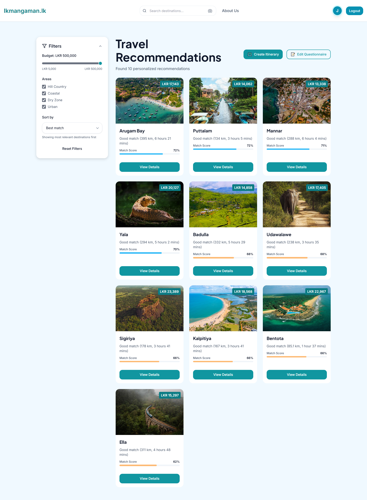
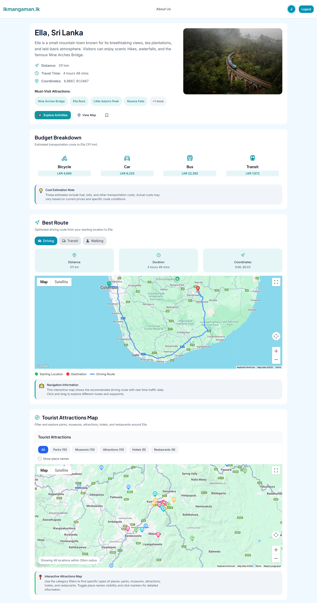
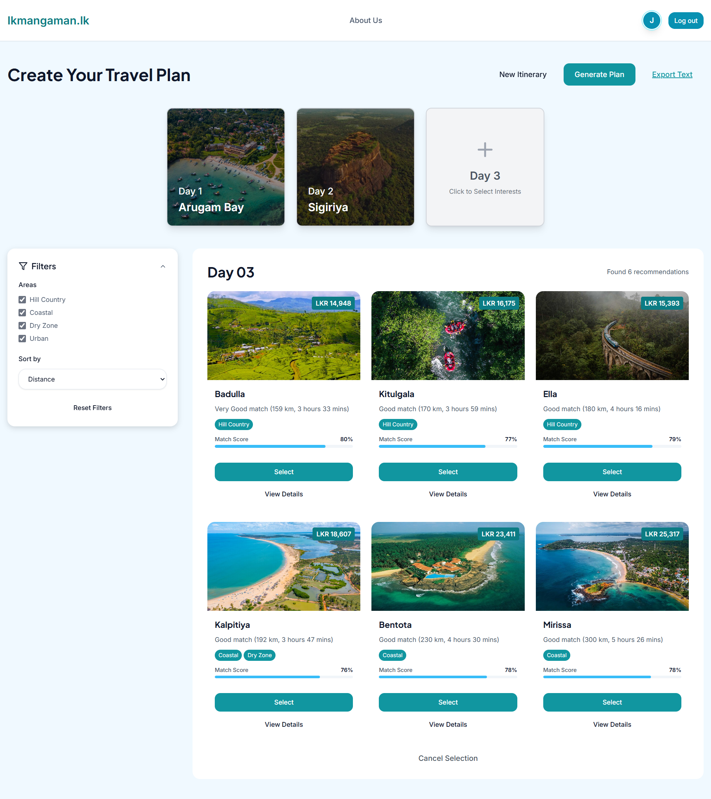
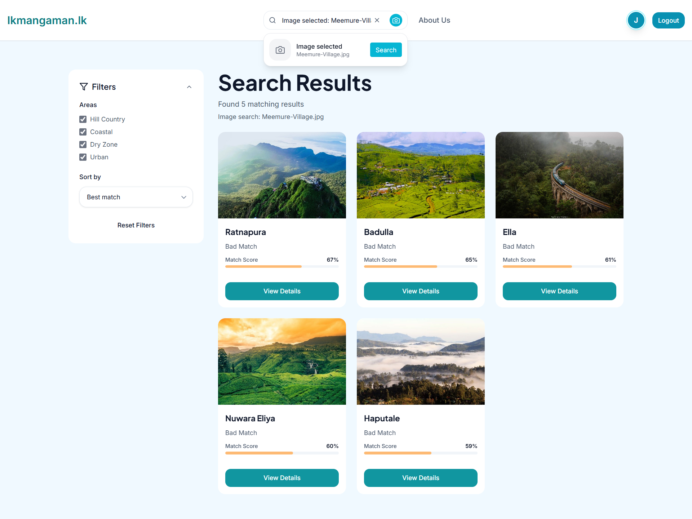

# 🌍 Ikmangaman.lk  

**Ikmangaman.lk** is an **AI-powered travel planning platform** designed to transform the way people explore **domestic tourism in Sri Lanka**.  
It helps travelers discover destinations that match their unique profile, plan personalized itineraries, and access practical details such as routes, hotels, crowd levels, and weather — all in one place.  

*Built with FastAPI, React, and AI-powered recommendation models.*  

---

## 🚀 Key Features  

- 🎯 **Personalized Recommendations**  
  AI predicts traveler types (e.g., Backpacker, Nature Lover, Spiritual Explorer) and suggests destinations accordingly.  

- 🗺️ **Interactive Route Visualization**  
  Google Maps integration to display travel routes, distance, and estimated time.  

- 🏞️ **Destination Insights**  
  Each location includes attractions, nearby activities, and travel essentials.  

- 🌦️ **Weather Updates**  
  Real-time forecasts to help travelers prepare better.  

- 📝 **Itinerary Generator**  
  Automatic daily itineraries based on preferences and trip duration.  

- 🔍 **Visual search**  
  Upload an image to find similar destinations.
---

## 🛠️ How It Works  

1. **Traveler Questionnaire** → Users answer simple questions about their preferences.  
2. **AI Traveler Type Prediction** → Our model classifies the user into a traveler type.  
3. **Destination Matching** → The system recommends destinations tagged with matching interests & seasonal suitability.  
4. **Interactive Exploration** → Users can view maps, attractions, weather, hotel and guide details.  
5. **Itinerary Generation** → Create a full trip plan with recommended destinations for each day.  

---

## 📸 Screenshots  

### Recommendations page  

  

### Destination Page  

  

### Itinerary page  

  

### Search by image   

---

## 🌐 Website  

👉 [Visit Ikmangaman.lk](https://ikmangaman.netlify.app)  

---

## 👥 Team  

- **Nisal Sanjula** 
- **Yasiru Hansana** 
- **Anupama Wickramasinghe** 
- **Buvindu Suraweera** 
